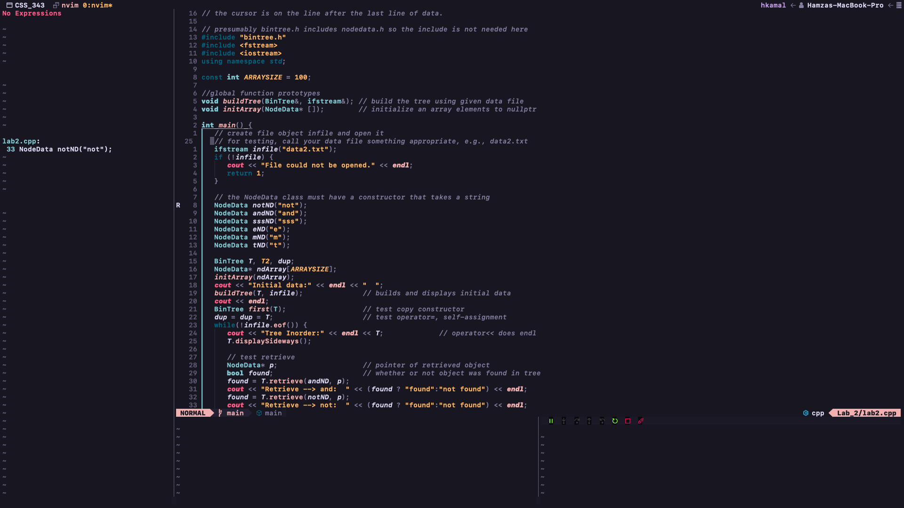

# My Neovim Configuration
## Features

### Syntax Highlighting
Provides Syntax Highliting for code using [nvim-treesitter](https://github.com/nvim-treesitter/nvim-treesitter).

### Fuzzy Finder
Uses [telescope](https://github.com/nvim-telescope/telescope.nvim) to quickly find files in your project.

### LSP and CMP
Has [LSP](https://github.com/neovim/nvim-lspconfig) integration to provide suggestions and snippets using [nvim-cmp](https://github.com/hrsh7th/nvim-cmp) while writing code.

### DAP
Includes debugging for C++ and Python by using [nvim-dap](https://github.com/mfussenegger/nvim-dap).

## Installation
To install this config download the [install.sh]() or [install.bat]() script depending on the operating system from the releases page and run it in the terminal. Make sure you have [git](https://git-scm.com) installed.
